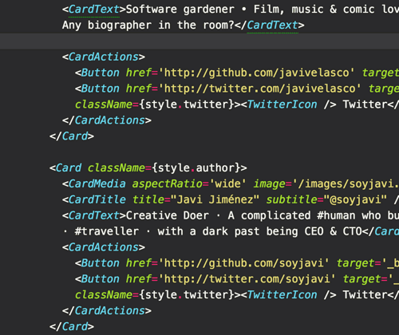

# React propTypes autocomplete

Autocomplete prop types for any react component. DX for the win!

- Component Name autocompletion
- PropType autocompletion and inline documentation
- your feature here!

## Install
1. Search for the atom package and install
2. `npm i react-autocomplete-cli --save-dev` in your project
3. in your project add `generate: "rc-autocomplete"` to your npm scripts

`completions.json` is what the atom plugin uses to auto complete your props

## How does this work?

Configuration is the same as import-js https://github.com/Galooshi/import-js#configuration to enable future improvements and possible automated imports

[React Docgen](https://github.com/reactjs/react-docgen) generates data that is parsed into readable tokens (`completions.json`) for consumption of the atom autocomplete+ [provider](https://github.com/atom/autocomplete-plus/wiki/Provider-API) (see `lib/provider` for how the provider works)

# Todo:
- [] Get this working as standalone CLI
- [] Separate CLI from Atom plugin
- [] Update autocomplete to support values of props
- [] Make autocomplete output pluggable (custom prompts)
- [] Make custom docs link pluggable
- [] Generate output for sublime text
- [] ... ?

## Atom plugin

The atom plugin uses the autocomplete-plus https://github.com/atom/autocomplete-plus/wiki/Provider-API

# Inspiration

Thanks to atom https://github.com/atom/autocomplete-html/blob/master/lib/provider.coffee for the inspiration on building this

Also:

- https://twitter.com/davatron5000/status/731249986600456192
- https://github.com/buzzfeed/solid-completions
- https://github.com/Galooshi/atom-import-js/blob/a0da349ccd547c9b503da30f60e8ccd26439104d/lib/getImporter.js
