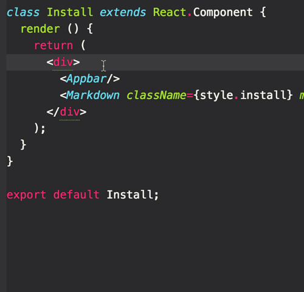

# React propTypes autocomplete

Autocomplete prop types for components

## Install
1. Clone this repo into your atom packages folder: `/Users/YOUR_USER_NAME/.atom/packages`
2. Run `npm i` to install deps then `npm run generate` for react-toolbox autocompletions

For your own component autocompletions run `node generate-completions.js --src 'your_path/components/**/*.js'` to generate your own `completions.json` file.

`completions.json` is what the atom plugin uses to auto complete your props

# Todo:
- [] Get this working as standalone CLI
- [] Separate CLI from Atom plugin
- [] Update autocomplete to support values of props
- [] Make autocomplete output pluggable (custom prompts)
- [] Make custom docs link pluggable
- [] Generate output for sublime text
- [] ... ?

# Inspiration

Thanks to atom https://github.com/atom/autocomplete-html/blob/master/lib/provider.coffee for the inspiration on building this

Also:

- https://twitter.com/davatron5000/status/731249986600456192
- https://github.com/buzzfeed/solid-completions
